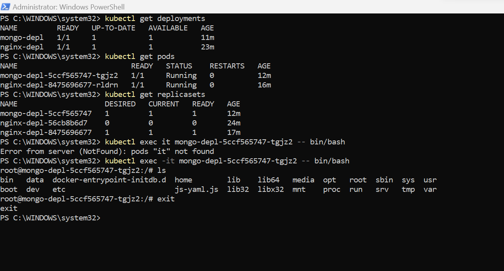
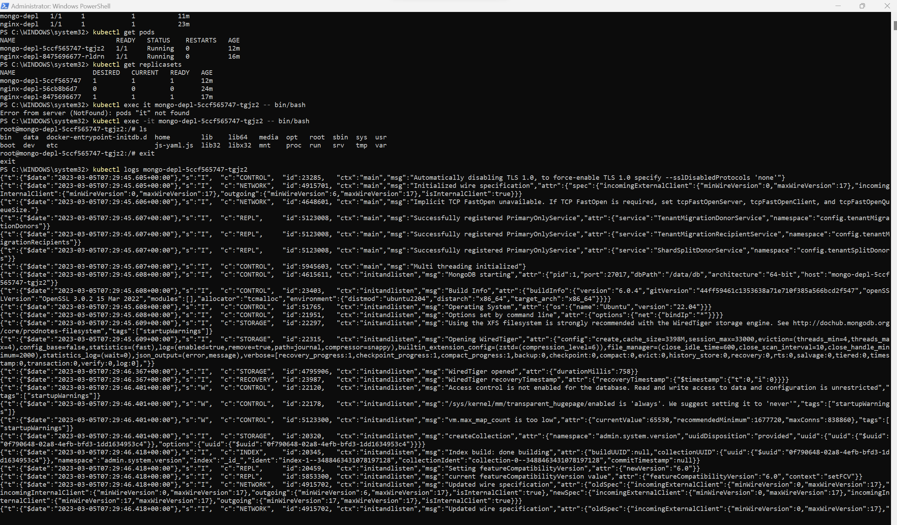
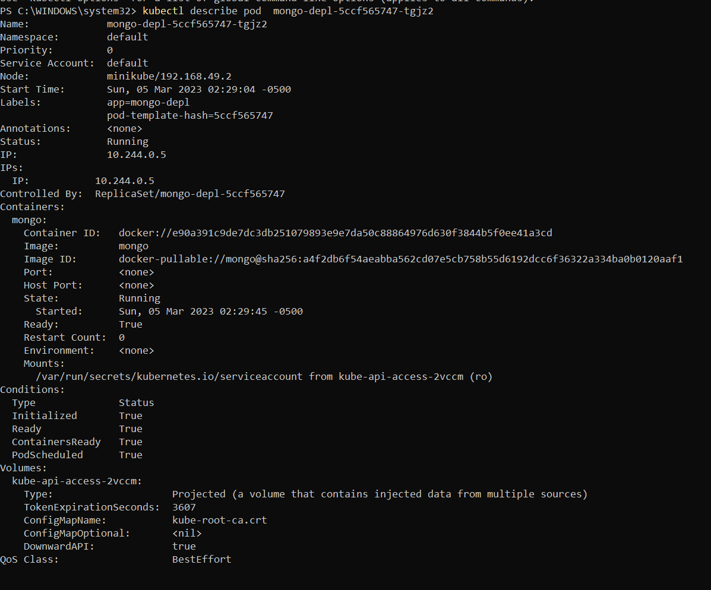

# K8s Troubleshooting and Debugging
To describe several commands that can be used for troubleshooting and debugging Kubernetes applications. These commands can help you identify and diagnose issues with your resources, such as pods, services, and nodes.


## Prerequisites
Before using these commands, you'll need to have the following tools installed:

+ kubectl: the Kubernetes command-line tool
+ docker: the Docker command-line tool (if you're working with container images)

You'll also need access to a Kubernetes cluster.

## Commands
Here are the troubleshooting and debugging commands that we'll cover in this document:

+ exec
+ logs
+ describe
+ logs
+ attach
+ port-forward
+ proxy
+ cp
+ auth
+ debug

### logs
The logs command is used to print the logs for a container in a pod. This can be useful for troubleshooting issues with your application, such as error messages or unexpected behavior.

To print the logs for a container in a pod:

```
PS C:\WINDOWS\system32> kubectl exec -it mongo-depl-5ccf565747-tgjz2 -- bin/bash
```



### exec
The exec command is used to execute a command in a container. This can be useful for troubleshooting issues with your application, such as running diagnostic commands or modifying configuration files.

To execute a command in a container:

```
PS C:\WINDOWS\system32> kubectl logs mongo-depl-5ccf565747-tgjz2
```



### describe
The describe command is used to show detailed information about a specific Kubernetes resource or a group of resources. This can be useful for troubleshooting issues with your resources, such as pods or services.

To describe a specific pod:

```
PS C:\WINDOWS\system32> kubectl describe pod  mongo-depl-5ccf565747-tgjz2
```




## Conclusion
Using these Kubernetes troubleshooting and debugging commands can help you identify and diagnose issues with your resources, and enable you to quickly resolve problems with your applications and infrastructure. With these tools at your disposal, you'll be well-equipped to handle a wide variety of troubleshooting scenarios in your Kubernetes environment.
